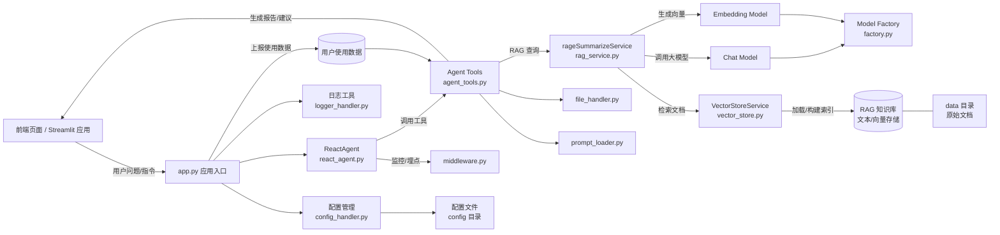

## 智扫通Agent 项目说明

本项目是一个面向消费者（toC）的**扫地机器人智能客服系统**，目标是在用户购买前、使用中与售后阶段，提供贯穿全生命周期的问答与决策支持服务。系统基于 RAG（Retrieval-Augmented Generation）技术，从扫地机器人领域知识库中检索准确信息，并生成自然语言回答或建议。

### 一、核心功能

- **智能问答服务**
  - 处理购买前咨询：如功能差异、价格、型号对比、适用户型等。
  - 解决使用与售后问题：如操作指引、故障排查、维护保养建议等。
  - 依托 RAG 技术，从知识库中检索高置信度文档片段，结合大模型生成可靠回复。

- **使用报告与优化建议**
  - 针对已购用户，自动分析扫地机器人的使用数据（如清洁频率、耗材状态、错误日志等）。
  - 生成个性化使用报告，总结使用情况并提出优化建议（如清扫计划、禁区设置、耗材更换提醒等）。
  - 支持用户主动查询报告或系统定期推送，帮助用户最大化产品价值。

### 二、代码目录结构（规划阶段）

> 目前仅定义目录与模块职责，不编写具体实现代码，后续开发将在此结构基础上逐步完善。

```text
zhisaotong_agent/
  ├─ agent/                     # 智能体相关逻辑
  │  ├─ tools/                  # 智能体可调用的工具集合
  │  │  ├─ agent_tools.py       # 业务工具：RAG 查询、获取用户信息、生成外部数据等
  │  │  └─ middleware.py        # 工具调用前后的监控、日志、埋点等中间件
  │  └─ react_agent.py          # ReAct（推理 + 动作）智能体封装与对话流控制
  │
  ├─ config/                    # 配置文件（模型、RAG、数据源等）
  │
  ├─ data/                      # 原始数据与中间数据（如嵌入前文本、索引缓存等）
  │
  ├─ model/                     # 模型抽象与工厂
  │  └─ factory.py              # chat / embedding 等模型实例的统一创建入口
  │
  ├─ prompts/                   # 提示词模板与对话系统提示
  │
  ├─ rag/                       # RAG 相关服务
  │  ├─ rag_service.py          # 文档检索 + 总结服务（如 rag_summarize 等）
  │  └─ vector_store.py         # 向量库封装与检索器构建
  │
  ├─ utils/                     # 通用工具模块
  │  ├─ chain_debug.py          # 调试链路、打印中间结果
  │  ├─ config_handler.py       # 配置文件读写与合并
  │  ├─ file_handler.py         # 文件加载、遍历与编码处理
  │  ├─ logger_handler.py       # 日志封装
  │  ├─ path_tool.py            # 路径拼接与项目根路径管理
  │  └─ prompt_loader.py        # 提示词文件加载工具
  │
  ├─ app.py                     # Streamlit 或 Web 接口入口（对接前端页面）
  └─ README.md                  # 项目总 README（可与本说明合并或引用）
```

### 三、模块间逻辑架构（Mermaid）

> 下图以 Mermaid 描述主要模块间的调用与依赖关系，仅为架构设计示意，不包含任何实现细节。



### 四、后续开发建议

- **第一阶段**：搭建基础工程（虚拟环境、依赖管理、基础配置与日志），补充 `README.md` 与本说明文件的关联。
- **第二阶段**：实现向量库构建与 RAG 服务（`rag_service.py`、`vector_store.py`），并导入扫地机器人知识文档。
- **第三阶段**：实现智能体逻辑（`ReactAgent` 及工具函数），打通从前端到 RAG 的完整闭环。
- **第四阶段**：接入真实用户数据与报表生成能力，迭代优化对话体验与报告模板。

